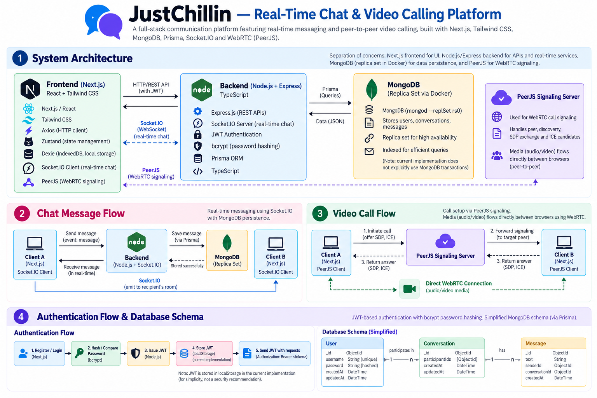

# JustChillin — Real-Time Chat & Video Calling Platform

A full-stack communication platform that provides **real-time messaging** and **peer-to-peer video calling** through a modern web application.

The project combines a **Next.js frontend**, **Node.js/Express backend**, **Socket.IO** for real-time communication, **WebRTC via PeerJS** for video calls, and **MongoDB with Prisma** for persistent application data.



---

## ✨ Features

- 💬 **Real-Time Messaging** — Instant message delivery using Socket.IO.
- 📹 **Peer-to-Peer Video Calling** — Browser-to-browser audio/video communication using WebRTC through PeerJS.
- 🔐 **JWT Authentication** — User registration/login with password hashing using bcrypt.
- 👥 **Conversation / Room Management** — Supports communication through conversation or room-based flows.
- 💾 **Persistent Messages** — Chat data is stored in MongoDB through Prisma.
- ⚡ **Modern Web UI** — Built with Next.js and Tailwind CSS.
- 🐳 **Containerized MongoDB Replica Set** — MongoDB can be run locally as a replica set using Docker.

---

# 🏗️ System Architecture

The application separates the main responsibilities into four parts:

```text
                         ┌─────────────────────┐
                         │   Next.js Frontend  │
                         │   React + Tailwind  │
                         └──────────┬──────────┘
                                    │
                    ┌───────────────┴────────────────┐
                    │                                │
                HTTP/REST                         Socket.IO
                    │                                │
                    ▼                                ▼
              ┌─────────────────────────────────────────┐
              │       Node.js + Express Backend         │
              │                                         │
              │  REST APIs • Auth • Chat • Signaling   │
              │  Socket.IO • Prisma • Business Logic   │
              └───────────────┬───────────────┬─────────┘
                              │               │
                           Prisma          Socket.IO /
                              │             PeerJS signaling
                              ▼               │
                    ┌─────────────────┐       │
                    │    MongoDB      │       │
                    │   Replica Set   │       │
                    └─────────────────┘       │
                                              ▼
                                      ┌───────────────┐
                                      │ WebRTC / P2P  │
                                      │ Browser ↔     │
                                      │ Browser       │
                                      └───────────────┘
```

### Separation of Responsibilities

| Component | Responsibility |
|---|---|
| **Next.js / React** | UI, authentication screens, chat UI, video-call UI |
| **Node.js / Express** | REST APIs, authentication logic, business logic |
| **Socket.IO** | Real-time chat events and real-time communication |
| **PeerJS / WebRTC** | Video-call connection setup/signaling and peer-to-peer media |
| **Prisma** | Database access and ORM layer |
| **MongoDB** | Persistent users, conversations, and messages |
| **Docker** | Local MongoDB replica-set environment |

---

# 💬 Real-Time Messaging

Chat messages use Socket.IO for immediate delivery.

A simplified message lifecycle is:

```text
Client A
   │
   │ Socket.IO event
   ▼
Node.js / Socket.IO Server
   │
   ├──────────────► Prisma
   │                   │
   │                   ▼
   │               MongoDB
   │
   │ emit message event
   ▼
Client B
```

### Message Flow

1. Client A sends a message through the Socket.IO connection.
2. The backend receives and validates the event.
3. The message is persisted through Prisma/MongoDB.
4. The server emits the corresponding real-time event to the intended recipient/conversation.
5. Client B receives the message and updates the UI immediately.

This separates:

- **real-time delivery** → Socket.IO
- **persistent storage** → MongoDB

If a user refreshes the application, previously persisted messages can still be retrieved through the backend API.

---

# 📹 Video Calling

Video calling uses **WebRTC** for peer-to-peer media communication and **PeerJS** to simplify WebRTC connection management/signaling.

The important distinction is:

> **Socket.IO/PeerJS signaling helps establish the connection; the actual audio/video stream is intended to flow directly between the browsers once the WebRTC peer connection is established.**

Simplified flow:

```text
          Signaling
     ┌─────────────────┐
     │                 │
     ▼                 ▼
Browser A ───────► PeerJS / Server ───────► Browser B
    │                                             │
    │                                             │
    └──────────── WebRTC P2P Connection ─────────┘
                     │
                Audio / Video
```

### Video Call Lifecycle

1. User grants browser access to the camera/microphone.
2. A PeerJS/WebRTC peer connection is created.
3. The caller initiates a call with the target peer.
4. Signaling information is exchanged through the server.
5. WebRTC negotiates the peer connection.
6. Once connected, media is transferred through the WebRTC connection.

### Why is a server still required?

WebRTC being peer-to-peer does **not** mean the application needs no server.

A signaling mechanism is required to exchange information such as:

- SDP offers
- SDP answers
- ICE candidates
- peer identifiers
- call/session information

The server participates in **connection establishment**, while the media path can become peer-to-peer.

---

# 🔐 Authentication

The application uses JWT-based authentication with bcrypt for password hashing.

Conceptually:

```text
Registration / Login
        │
        ▼
Node.js Backend
        │
        ├── bcrypt → password hashing / verification
        │
        ▼
      MongoDB
        │
        ▼
    JWT generated
        │
        ▼
     Frontend
        │
        ▼
Authorization header on protected requests
```

### Passwords

Passwords should never be stored as plaintext.

Instead:

```text
Plain Password
      │
      ▼
   bcrypt
      │
      ▼
Password Hash
      │
      ▼
    MongoDB
```

During login, the supplied password is compared against the stored bcrypt hash.

### JWT

A successful authentication flow produces a JSON Web Token that can be supplied with subsequent authenticated requests.

Conceptually:

```text
Header
Payload
Signature
```

The server verifies the token before allowing access to protected resources.

> **Security note:** The current implementation stores authentication state/token information on the client side. For a production deployment, token storage and XSS/CSRF protections should be reviewed carefully.

---

# 🗄️ Database

MongoDB is used as the persistent data store, with Prisma providing the ORM/data-access layer.

The core data model contains entities around:

```text
User
  │
  │ participates in
  ▼
Conversation
  │
  │ contains
  ▼
Message
```

A simplified conceptual structure is:

```text
User
├── id
├── name / username
├── email
├── passwordHash
└── timestamps

Conversation
├── id
├── participants
└── timestamps

Message
├── id
├── conversationId
├── senderId
├── content
└── timestamps
```

The exact schema should be treated as defined by the Prisma schema in the repository.

---

# 🧩 Why Socket.IO and WebRTC Both?

These technologies solve different problems.

| Technology | Purpose |
|---|---|
| **Socket.IO** | Real-time application events such as chat messages and signaling |
| **WebRTC** | Peer-to-peer audio/video communication |
| **PeerJS** | Simplifies the WebRTC peer connection/signaling interface |

For example:

```text
Text Message
    ↓
Socket.IO
    ↓
Server
    ↓
Socket.IO
    ↓
Recipient
```

Whereas:

```text
Video Call
    ↓
PeerJS / Signaling
    ↓
WebRTC Negotiation
    ↓
Browser A ═════════ Browser B
              P2P
          Audio / Video
```

---

# 🌐 Networking Concepts

The project provides practical exposure to several networking concepts:

### HTTP/REST

Used for conventional request/response operations such as:

- registration
- login
- retrieving users
- retrieving messages
- retrieving conversations

### WebSocket / Socket.IO

Used where the server needs to push events to connected clients without requiring the client to repeatedly poll.

### WebRTC

Used for low-latency peer-to-peer media communication.

---

# 🐳 MongoDB Replica Set with Docker

The project includes a Docker-based MongoDB replica-set setup for local development.

The purpose of a replica set is to run MongoDB in a replication-aware configuration rather than as a completely standalone database process.

This provides a useful environment for understanding:

- primary/secondary MongoDB architecture
- replica-set configuration
- database availability
- connection strings containing replica-set information
- how application services connect to a replica-set deployment

> **Important:** Running MongoDB as a replica set does not automatically mean that every database operation in the application is a multi-document ACID transaction. Transactions must be explicitly implemented using MongoDB sessions/transaction APIs when required.

---

# 🛠️ Tech Stack

| Layer | Technology |
|---|---|
| Frontend | Next.js, React, Tailwind CSS |
| HTTP Client | Axios |
| Client State | Zustand |
| Local Storage | Dexie / IndexedDB |
| Backend | Node.js, Express.js |
| Backend Language | TypeScript / JavaScript as used by the repository |
| Real-Time Communication | Socket.IO |
| Video Calling | WebRTC, PeerJS |
| Authentication | JWT, bcrypt |
| ORM | Prisma |
| Database | MongoDB |
| Local Database Environment | Docker |

---

# 📁 Project Structure

The repository is organized around the frontend, backend, database/Prisma configuration, and Docker setup.

A conceptual structure is:

```text
JustChillin/
│
├── frontend/
│   ├── app/
│   ├── components/
│   ├── ...
│
├── backend/
│   ├── routes/
│   ├── controllers/
│   ├── socket/
│   ├── ...
│
├── prisma/
│   ├── schema.prisma
│   └── migrations/
│
├── docker/
│   └── MongoDB replica-set configuration
│
├── .env.example
├── docker-compose.yml
└── README.md
```

> The exact directory names may differ from this conceptual layout; the repository's current source tree and Prisma schema are authoritative.

---

# 🚀 Getting Started

## Prerequisites

Install:

- Node.js
- npm
- Docker / Docker Compose
- MongoDB tooling if required by your local environment

---

## 1. Clone the Repository

```bash
git clone https://github.com/adtya06/JustChillin.git
cd JustChillin
```

---

## 2. Configure Environment Variables

Create the required environment files using the repository's `.env.example` as the template.

Typical configuration includes values for:

```env
DATABASE_URL=your_mongodb_connection_string
JWT_SECRET=your_secret
```

Do **not** commit actual credentials or secrets.

---

## 3. Start MongoDB

If using the included Docker configuration:

```bash
docker compose up -d
```

Verify that the MongoDB replica-set environment is running before starting the backend.

---

## 4. Install Backend Dependencies

```bash
cd backend
npm install
```

Generate the Prisma client:

```bash
npx prisma generate
```

Run the backend using the repository's configured development command.

---

## 5. Install Frontend Dependencies

```bash
cd frontend
npm install
```

Run the Next.js development server using the repository's configured development command.

---

# 🔌 API & Real-Time Interfaces

The backend exposes conventional REST endpoints alongside Socket.IO events.

Typical responsibilities include:

### Authentication

```text
Register
Login
User authentication
```

### Users

```text
Retrieve user/profile information
```

### Messages

```text
Retrieve messages
Send messages
Persist messages
```

### Conversations / Rooms

```text
Create room/conversation
Retrieve room information
Manage participants
```

### Calling

```text
Call initiation
Peer/signaling information
WebRTC connection establishment
```

The exact route names and request/response schemas should be taken from the backend source and Prisma schema.

---

# 🔄 End-to-End Examples

## Sending a Message

```text
1. User types message
        ↓
2. Next.js client emits Socket.IO event
        ↓
3. Node.js backend receives event
        ↓
4. Backend persists message through Prisma
        ↓
5. MongoDB stores message
        ↓
6. Socket.IO broadcasts/emits message
        ↓
7. Recipient receives message instantly
```

## Starting a Video Call

```text
1. User starts call
        ↓
2. PeerJS/WebRTC call is initiated
        ↓
3. Signaling information is exchanged
        ↓
4. SDP / ICE information is negotiated
        ↓
5. Browser establishes WebRTC connection
        ↓
6. Audio/video flows peer-to-peer
```

---

# ⚖️ Design Decisions & Trade-offs

### Why Socket.IO?

Socket.IO provides a convenient event-driven abstraction for real-time communication, including connection management and application-level events.

### Why WebRTC?

WebRTC is designed for real-time peer-to-peer audio/video communication in browsers and avoids sending the media stream through the application server when a direct connection can be established.

### Why PeerJS?

PeerJS provides a higher-level interface around WebRTC peer connections and simplifies parts of the signaling/peer-management process.

### Why MongoDB?

The application deals naturally with user, conversation, and message documents, while MongoDB provides persistent storage for those entities.

### Why Prisma?

Prisma provides a structured data-access layer and schema-driven interaction with the database.

---

# ⚠️ Current Limitations

The current implementation is primarily a project/demo-scale real-time communication system. Areas that would require additional engineering for production include:

- TURN server deployment for restrictive NAT/firewall scenarios
- More robust WebRTC connection recovery
- Group video calling
- Horizontal scaling of Socket.IO servers
- Redis or another shared pub/sub layer for multi-instance Socket.IO deployments
- More comprehensive authentication/authorization middleware
- Production-grade token storage and CSRF/XSS hardening
- Rate limiting
- Input validation across all APIs
- Observability, logging, and monitoring
- Automated tests
- Production deployment and infrastructure
- More extensive load and reliability testing

---

# 🚧 Future Improvements

Potential extensions include:

- Group chat and group video calls
- TURN/STUN infrastructure for improved NAT traversal
- Call history and presence indicators
- Message delivery/read receipts
- Typing indicators
- File/image sharing
- Push notifications
- Redis-backed Socket.IO scaling
- Better WebRTC reconnection handling
- End-to-end encryption for appropriate communication flows
- Automated integration and end-to-end tests
- Production deployment with monitoring and centralized logging

---

# 🎯 What This Project Demonstrates

This project demonstrates practical experience with:

- Full-stack web development
- Next.js / React
- Node.js / Express
- TypeScript/JavaScript
- REST APIs
- WebSocket-based real-time communication
- Socket.IO
- WebRTC
- PeerJS
- Authentication and authorization concepts
- JWT
- bcrypt password hashing
- MongoDB
- Prisma ORM
- Docker
- Replica-set database environments
- Client-side state management
- Browser local storage / IndexedDB

---

## 📌 Interview Focus

The most important technical concepts behind this project are:

```text
HTTP vs WebSocket
        ↓
Socket.IO
        ↓
Real-Time Messaging
        ↓
WebRTC
        ↓
Signaling
        ↓
SDP + ICE
        ↓
STUN / TURN
        ↓
NAT Traversal
        ↓
Peer-to-Peer Media
```

Understanding this flow is more important than memorizing individual APIs.

---

## License

This project is intended as a personal/academic project.
